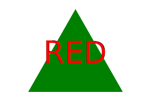
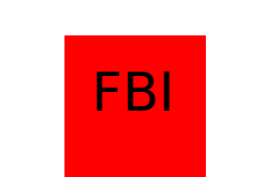

# LOGO-GO

https://github.com/anna071387/LOGO-GO

## Description

This is a "prompt-response" simple logo generator of an SVG file with text inside. 

## Usage

This quick logo generator helps to create a simple shape logo with identified text by a user.
It generates a prompt response questions for a survey of needs. 

## Features

Creates a shape defined by a user: circle, square or triangle and inputs a text logo on the inside.

